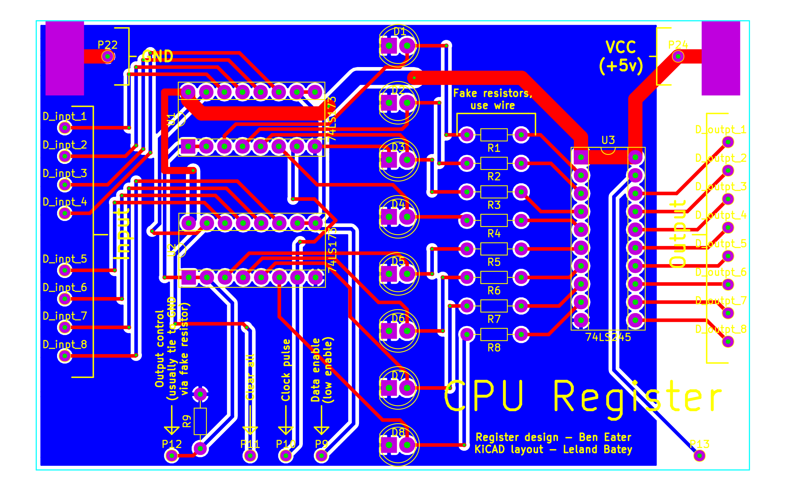

CPU Register
============

This repo contains PCB designs for the second component of Ben Eater's
educational 8-bit CPU, the CPU registers. You can [watch Mr. Eaters *fantastic*
series on designing and building this CPU on his Youtube
channel.](https://www.youtube.com/user/eaterbc/videos)

Each CPU will need three of these registers, one to act as the **instruction**
register, one as the **A** register, and one as the **B** register. The
difference between the A/B registers and the instruction register is that the
four most significant bits of the instruction register won't be directed back
onto the bus, but instead are used as input to the instruction decoder. The
design intentionally incorporates fake resistors in between the LED's and the
LS74245 which may be used as the point where those four most significant bits
are split off towards the instruction decoder.

